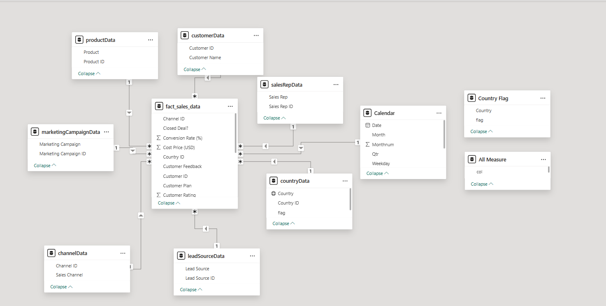
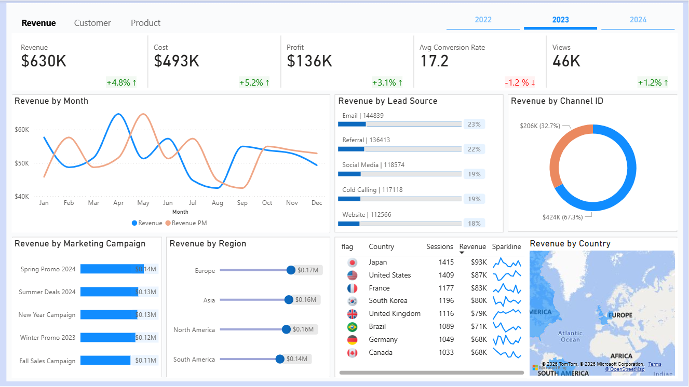
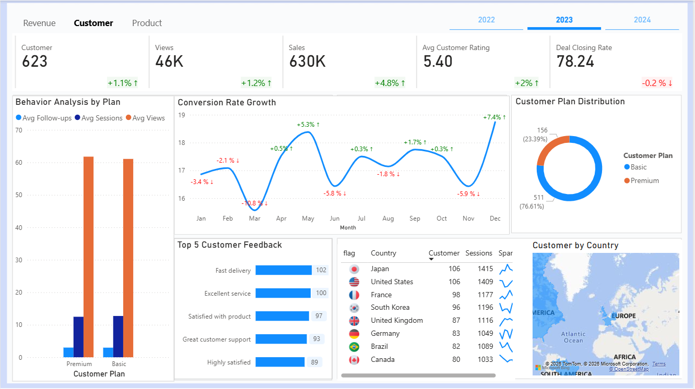
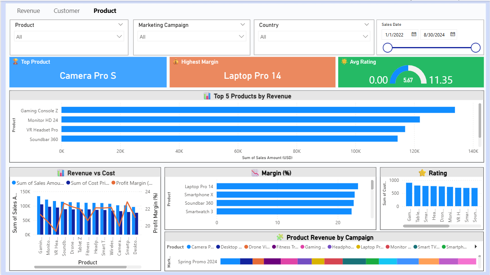

# Retail Omnichannel Sales Performance Dashboard (2022–2024) — Power BI Case Study

## Overview
This project delivers a **Retail Omnichannel Sales Performance Dashboard (2022–2024)** built in **Power BI** to help Sales & Marketing stakeholders monitor historical performance and understand what drives **revenue** and **profitability**.  
I consolidated five raw CSV files into a structured dimensional model (star schema), performed data cleaning and transformations in Power Query, and designed three analytical views—**Revenue, Customer, and Product**—to surface key trends, top contributors, and actionable insights across channels, lead sources, campaigns, and countries.

---

## Objectives
- Provide a **single source of truth** for historical sales performance (2022–2024).
- Identify **key drivers** of revenue and profit across major business dimensions.
- Enable quick exploration from 3 perspectives:
  - **Revenue** (performance & drivers)
  - **Customer** (segment behavior & quality signals)
  - **Product** (top contributors & profitability)

---

## Business Context (Retail Omnichannel)
A retail business sells through multiple **sales channels** and acquires leads via different **lead sources** (email, referral, social media, cold calling, website) while running periodic **marketing campaigns**. Stakeholders need a clear, consistent view of performance across **channels, campaigns, and geographies**.

However, the data is originally stored in multiple CSV files, making analysis time-consuming and prone to inconsistencies. This dashboard centralizes the data and provides decision-ready insights.

---

## Problem Statement
Sales & Marketing teams need a reliable way to answer: **what drives revenue and profit**, **which customer segments perform best**, and **which products should be prioritized**—considering differences across channels, lead sources, campaigns, and countries.

To address this, I built a **Power BI Sales Performance Dashboard** that integrates and cleans raw data from five CSV files, models it using a **star schema**, and presents the results through intuitive KPI tracking and drilldowns.

---

## Key Business Questions
### Revenue Perspective
- How do **Revenue, Cost, and Profit** trend over time (2022–2024)?
- Which **lead sources** and **sales channels** contribute the most to revenue?
- Which **marketing campaigns** are most effective historically?
- Which **regions/countries** are top revenue drivers?
- How do **Views** and **Conversion Rate** behave alongside revenue changes?

### Customer Perspective
- How does the customer base behave over time, and what signals indicate quality (rating/closing)?
- How do **Basic vs Premium** customers differ in engagement?
- How volatile is **conversion rate growth**, and when does it drop?
- What are the most common **customer feedback themes**?
- Which countries contain the most customers / sessions?

### Product Perspective
- Which products generate the most revenue, and which have the highest margins?
- Are there products with potential **margin pressure** (high cost relative to revenue)?
- How does product **rating** relate to product performance?
- Which campaigns align best with product revenue contribution?

---

## Dataset
**Source files (CSV):**
1. `customer.csv`
2. `product_stock_table.csv`
3. `sales_data.csv`
4. `sales_target.csv` *(available, but not used for target vs actual in this dashboard)*
5. `country_flag.csv` *(used for country flag images/visual cues)*

**Note:** This dashboard focuses on **historical performance (2022–2024)** and does **not** include target vs actual comparisons.

---

## Tools & Skills Demonstrated
- **Power BI**
  - Power Query (data cleaning, transformations, merging tables)
  - Data Modeling (dimensional/star schema)
  - Visualization & Dashboard design
- Analytical Skills
  - Business question framing
  - KPI selection and interpretation
  - Insight → recommendation storytelling

---

## Data Preparation (Power Query)
Key preparation steps:
- Standardized data types (dates, numeric fields, categories).
- Cleaned inconsistent values and ensured key columns were usable for relationships.
- Merged/joined tables where necessary to build consistent dimensions and facts.
- Structured the dataset into a dimensional model to support fast slicing and reliable aggregation.

📌 Full list: [Power Query Steps](./docs/power_query_steps.md)
---

## Data Modeling (Star Schema)
I built a dimensional model with a central fact table and multiple dimension tables to enable consistent analysis across time, product, customer, channel, campaign, and geography.

- **Fact table**
  - `fact_sales_data`

- **Dimension tables (examples)**
  - `dim_customer`
  - `dim_product`
  - `dim_country`
  - `dim_calendar`
  - `dim_sales_channel`
  - `dim_lead_source`
  - `dim_marketing_campaign`
  - *(and other supporting dims shown in the schema)*

**Schema (Power BI Model View):**  

**Why star schema?**
- Cleaner relationships (1-to-many), fewer ambiguities
- Easier slicing (customer/product/channel/country)
- More scalable and recruiter-recognizable as “analytics-ready modeling”

---

## DAX Highlights (Measure-Driven Dashboard)
This dashboard is powered by an extensive **DAX measure library** to standardize KPIs and improve usability:
- KPI packs for each metric (PY, Variance, Growth %, Growth Arrow, Color)
- Time intelligence comparisons (2022–2024)
- Contribution measures (e.g., Revenue % of Lead Source)
- UX helpers (dynamic titles/tooltips & conditional formatting)

📌 Full list: [DAX Measure Library](./docs/dax-measure-library.md)

---

## Dashboard Pages
### 1) Revenue View
Focus: performance trends + revenue drivers by lead source/channel/campaign/region/country.

Main KPIs shown:
- Revenue, Cost, Profit
- Conversion Rate
- Views
- Trend by month

Breakdowns:
- Lead Source contribution
- Channel contribution
- Marketing campaign effectiveness
- Region & country performance

---

### 2) Customer View
Focus: customer base behavior + engagement quality signals + plan segmentation + feedback themes.

Main KPIs shown:
- Total customers
- Views, Sales
- Avg customer rating
- Deal closing rate

Breakdowns:
- Basic vs Premium distribution
- Behavior analysis by plan (views/sessions/follow-ups)
- Conversion rate growth (monthly)
- Top customer feedback
- Customer distribution by country

---

### 3) Product View
Focus: top products by revenue + profitability lens (margin) + revenue vs cost + rating.

Breakdowns:
- Top products by revenue
- Highest margin products
- Revenue vs cost per product
- Product rating distribution
- Product revenue by campaign

---

## Insights & Recommendations

### A) Revenue Insights (2022–2024)
**Insight:** Overall revenue performance shows positive growth, but costs also increased, indicating possible margin pressure.  
**Evidence (from dashboard):**
- Total Revenue: **$630K**
- Total Cost: **$493K**
- Total Profit: **$136K**
- Revenue change: **+4.8%**, Cost change: **+5.2%**, Profit change: **+3.1%**
**Implication:** Profit grows, but cost grows faster → margin risk.  
**Recommendation:** Review cost drivers during high-cost periods (discounting, procurement, logistics) and optimize to protect margin.

**Insight:** Funnel efficiency requires attention—conversion rate slightly declined while views increased.  
**Evidence:**
- Views: **46K** (**+1.2%**)
- Conversion Rate: **17.2** (**-1.2%**)
**Implication:** Traffic is present, but converting is harder → quality/friction issue.  
**Recommendation:** Improve mid-to-bottom funnel: qualify leads by channel/source, optimize messaging/offer, and refine follow-up process.

**Insight:** Revenue is driven mainly by Email and Referral lead sources and concentrated in one channel.  
**Evidence:**
- Email: **$144,839 (23%)**
- Referral: **$136,413 (22%)**
- Channel concentration: **$424K (67.3%)** vs **$206K (32.7%)**
**Implication:** Strong drivers exist but concentration increases risk.  
**Recommendation:** Scale Email/Referral with segmentation and incentives; diversify revenue by improving the smaller channel with targeted campaigns.

**Insight:** Seasonal campaigns drive a large portion of revenue.  
**Evidence (Top campaigns):**
- Spring Promo 2024: **$0.14M**
- Summer Deals 2024: **$0.13M**
- New Year Campaign: **$0.13M**
**Recommendation:** Build campaign playbooks based on winning seasonality (timing, channel mix, message) and replicate for future cycles.

**Insight:** Regions such as Europe/Asia/North America consistently contribute high revenue; top countries include Japan and the US.  
**Recommendation:** Prioritize budget and localized strategies for top regions/countries; run deeper analysis for countries with strong revenue but declining conversion.

---

### B) Customer Insights (2022–2024)
**Insight:** Customer satisfaction signals are strong, while closing rate is stable with a slight decline.  
**Evidence:**
- Avg Customer Rating: **5.40 (+2%)**
- Deal Closing Rate: **78.24 (-0.2%)**
**Implication:** Experience is good; closing efficiency needs monitoring.  
**Recommendation:** Use satisfaction as leverage for loyalty/referral; investigate slight closing drop (lead quality, response time, offer fit).

**Insight:** Customer base is dominated by Basic plan, leaving room for Premium upsell.  
**Evidence:**
- Basic: **511 (76.61%)**
- Premium: **156 (23.39%)**
**Implication:** Growth opportunity through converting high-engagement Basic users to Premium.  
**Recommendation:** Create upsell targeting: identify active Basic users (high views/sessions/follow-ups) and promote Premium benefits (bundles, exclusive offers).

**Insight:** Feedback themes emphasize service & delivery as key strengths.  
**Evidence (Top feedback):**
- Fast delivery (**102**), Excellent service (**100**), Satisfied with product (**97**), Great customer support (**93**)
**Implication:** Brand strength = service experience.  
**Recommendation:** Use service/delivery as campaign messaging; keep service SLA strong to sustain conversion and retention.

**Insight:** Customer distribution is concentrated in several countries.  
**Recommendation:** For top countries, run localized retention/upsell; for high-customer but lower sales countries, review product-market fit and offer strategy.

---

### C) Product Insights (2022–2024)
**Insight:** Revenue is concentrated in a few top products.  
**Evidence (Top products by revenue):**
- Gaming Console: **$46,260**
- Laptop: **$45,634**
- Smartphone: **$45,248**
- Smartwatch: **$44,502**
- Tablet: **$43,847**
**Implication:** These products are revenue engines; concentration increases risk.  
**Recommendation:** Secure stock and prioritize promotions for top products, while growing “next tier” products via bundling/cross-sell.

**Insight:** The highest-margin products align closely with top revenue products, especially Gaming Console.  
**Evidence (Top margin products):**
- Gaming Console: **33.40%**
- Laptop: **28.63%**
- Tablet: **25.73%**
- Smartphone: **24.61%**
- Smartwatch: **22.87%**
**Implication:** Profit can be maximized by pushing high-margin products.  
**Recommendation:** Prioritize high-margin products in campaigns and sales recommendations; review discount strategy to protect margin.

**Insight:** Revenue vs Cost patterns suggest potential margin pressure for some products.  
**Recommendation:** Identify products with small revenue–cost gaps and optimize procurement/logistics/pricing.

**Insight:** Product rating can indicate quality risk for high-selling products.  
**Recommendation:** If any top-selling products have lower ratings, prioritize quality fixes and customer support to prevent reputational impact.

---

## Limitations
- The dashboard is based on historical data (2022–2024) and does not include real-time updates.
- No target vs actual analysis is included in the current scope, even though a target file exists.
- Insights are descriptive/diagnostic; deeper causal analysis would require more variables (e.g., marketing spend, discount rate, delivery time, product category hierarchy).

---

## Next Steps (Future Improvements)
- Add **target vs actual** tracking if targets are reliable and aligned by time/product/channel.
- Add **inventory alerting** for top products using product stock data.
- Add deeper segmentation (cohort/retention) and profitability breakdown by country/channel.
- Add a “Campaign effectiveness” layer using uplift vs baseline.

---

## Project Files
- `dashboard.pbix` : [Dashboard](.sales_performance_analysis.pbix)
- `assets/` : screenshots + schema image
- `docs/` : data dictionary + transformation notes

> Repo structure:
> - `/assets/schema.png`
> - `/assets/revenue_view.png`
> - `/assets/customer_view.png`
> - `/assets/product_view.png`

---

## Author
**Dion Marshall**  
Role: Data Analyst (Power BI)  
Contact: linkedin.com/in/deonmarshal
